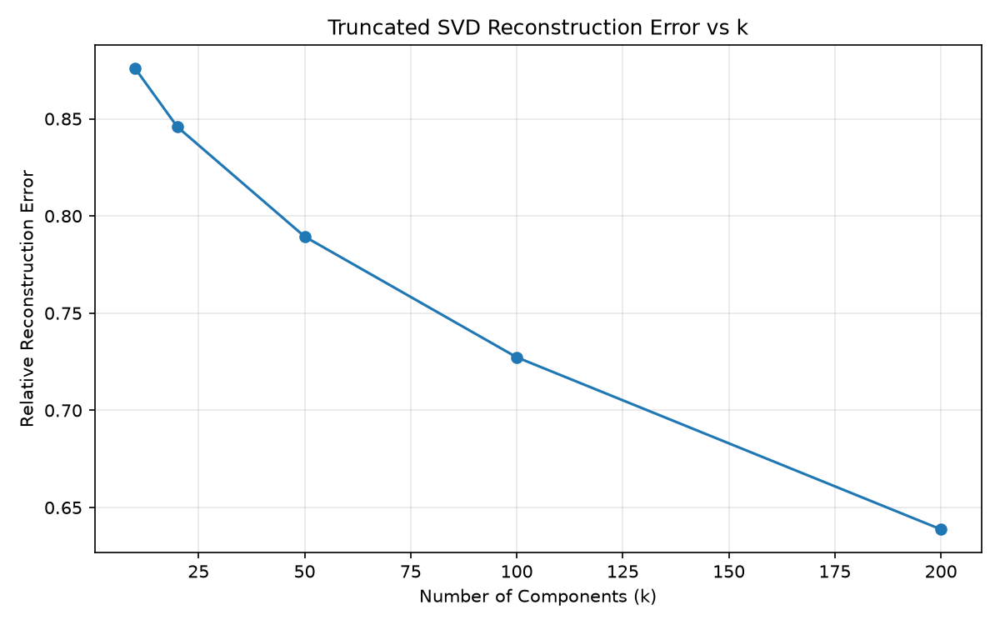
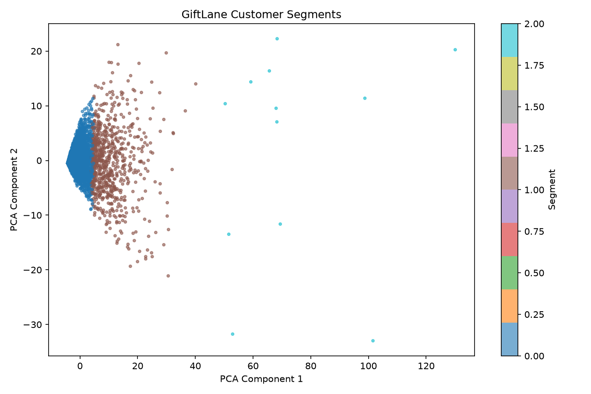

# MiniProject_LinearAlgebra

## Customers Like You — PCA or SVD for a Real Retail Problem

This project uses the UCI Online Retail II dataset to develop a product recommendation system and analyze customer purchasing patterns for GiftLane, a fictional online retailer.

Truncated SVD is used as the primary dimensionality reduction method and compared with PCA.

## Project Objectives

- Build a clean customer-product dataset.
- Reduce matrix size using dimensionality reduction.
- Generate Top-10 product recommendations.
- Evaluate recommendation performance against a best-seller baseline.
- Compare PCA and Truncated SVD.
- Visualize customer segments for marketing analysis.

## Dataset

**Source:** [UCI Online Retail II](https://archive.ics.uci.edu/dataset/502/online+retail+ii)

**Period:** December 2009 – December 2011

| Property | Value |
|---|---:|
| Total Rows | 1,067,371 |
| Columns | 8 |
| Unique Customers | 5,942 |
| Unique Product Codes | 5,305 |
| Missing Customer IDs | 243,007 |

The dataset contains two Excel sheets:

- 2009–2010: 525,461 rows
- 2010–2011: 541,910 rows

Raw data is stored locally in `data/raw/` and excluded from Git.

---

## DE1: Data Loading and Profiling

Both Excel sheets were loaded and analyzed using pandas.

The analysis examined column names, data types, missing values, unique customers, and product codes.

**Script:** `data_profile.py`

## DE2: Data Cleaning

Invalid transactions were removed before model training.

| Cleaning Rule | Rows Removed | Remaining Rows |
|---|---:|---:|
| Original Data | — | 1,067,371 |
| Cancelled Invoices | 19,494 | 1,047,877 |
| Non-positive Quantity | 3,457 | 1,044,420 |
| Non-positive Price | 2,750 | 1,041,670 |
| Non-product Stock Codes | 2,860 | 1,038,810 |
| Missing Customer ID | 235,890 | **802,920** |

Cleaning decisions are documented in `Cleaning_decisions.md`.

**Script:** `data_cleaning.py`

## DE3: Time-Based Train/Test Split

The final two months of transaction history were reserved for testing.

- **Training Period:** Before October 9, 2011, 12:50
- **Test Period:** October 9, 2011, 12:50 onward
- **Held-out Purchases:** Products not previously purchased by each customer

| Metric | Value |
|---|---:|
| Cleaned Rows | 802,920 |
| Training Rows | 684,312 |
| Test-period Rows | 118,608 |
| Held-out New-product Rows | 56,919 |
| Training Customers | 5,475 |

Only training data was used to construct the customer-product matrix and fit the models.

**Script:** `data_split.py`

## DE4: Sparse Customer-Product Matrix

A customer-product matrix was constructed using training transactions.

- **Purchase Value:** `log(1 + total purchased quantity)`
- **Product Filter:** Products purchased by at least 10 customers
- **Matrix Format:** CSR sparse matrix

| Metric | Value |
|---|---:|
| Customers | 5,475 |
| Products | 3,689 |
| Matrix Shape | 5,475 × 3,689 |
| Non-zero Entries | 413,983 |
| Sparsity | 97.95% |

Log transformation was selected to reduce the influence of unusually large orders while preserving purchase-volume information.

Sparse storage was used because most customer-product combinations contain zero purchases.

**Script:** `build_matrix.py`

## DE5: Matrix Statistics and Memory

| Metric | Value |
|---|---:|
| Total Matrix Entries | 20,197,275 |
| Non-zero Entries | 413,983 |
| Sparsity | 97.95% |
| Dense Storage | 154.09 MiB |
| Sparse CSR Storage | 4.76 MiB |
| Memory Reduction | 96.91% |
| Compression Ratio | 32.38× |

CSR storage reduced the original matrix's memory requirements by approximately 96.91%.

**Script:** `matrix_report.py`

**Report:** `reports/matrix_report.csv`

## DE6: Reproducible Data Pipeline

The complete data engineering pipeline can be executed using:

```bash
python build_matrix.py
```

This command performs data cleaning, time-based splitting, and sparse matrix construction.

---

## ML1: Dimensionality Reduction Method

**Truncated SVD** was selected because it operates directly on sparse matrices without mean centering.

PCA centers the data before decomposition, while Truncated SVD preserves the original sparse representation.

Truncated SVD also provides customer and product factors suitable for recommendation.

The method selection is documented in `Model_decisions.md`.

## ML2: Truncated SVD Experiments

Truncated SVD was evaluated using 10, 20, 50, 100, and 200 components.

- **Algorithm:** Randomized SVD
- **Iterations:** 7
- **Random State:** 42

| k | Explained Variance | Reconstruction Error |
|---|---:|---:|
| 10 | 19.83% | 87.61% |
| 20 | 25.25% | 84.58% |
| 50 | 34.88% | 78.94% |
| 100 | 44.72% | 72.73% |
| 200 | 57.36% | 63.88% |

Reconstruction error decreased as the number of components increased.

However, lower reconstruction error does not necessarily result in better recommendation performance.



**Script:** `train_svd.py`

**Report:** `reports/svd_results.csv`

## ML3: Product Recommendation System

Two recommendation approaches were implemented.

### Truncated SVD Recommendations

Customer embeddings and product factors are used to estimate preference scores for products.

Products already purchased during training are excluded from Top-10 recommendations.

### Popularity Baseline

Products are ranked by their total purchased quantity in the training data.

Previously purchased products are excluded.

### Product Similarity

Cosine similarity between normalized SVD product factors is used to identify the 10 most similar products.

The queried product itself is excluded from the results.

**Script:** `recommend.py`

## ML4: Recommendation Evaluation

Recommendations were evaluated using held-out purchases from the final two months.

- **Eligible Evaluation Customers:** 1,913
- **Unique Evaluable Customer-Product Pairs:** 44,729
- **Metrics:** Precision@10, Recall@10, Hit Rate@10

### Evaluation Results

| Model | Precision@10 | Recall@10 | Hit Rate@10 |
|---|---:|---:|---:|
| Popularity Baseline | 2.26% | 1.15% | 17.41% |
| SVD k=10 | 4.70% | 2.89% | 30.89% |
| SVD k=20 | 5.50% | 3.71% | 35.02% |
| **SVD k=50** | **6.13%** | 4.32% | 37.32% |
| SVD k=100 | 6.00% | **4.38%** | **38.06%** |

All tested SVD models outperformed the popularity baseline.

### Recommendation Runtime

| Model | Generation Time |
|---|---:|
| Popularity Baseline | 0.6310 s |
| SVD k=10 | 0.8640 s |
| SVD k=20 | 0.7953 s |
| SVD k=50 | 0.8084 s |
| SVD k=100 | 0.8211 s |

**Total experimental recommendation job time: 3.9280 seconds**

The measurements include model loading, recommendation generation, validation, and output storage, but exclude model training.

**Scripts:** `recommend.py`, `evaluate.py`

**Reports:**
- `reports/evaluation_results.csv`
- `reports/recommendation_runtime.csv`

## ML5: PCA vs. Truncated SVD

SVD k=50 was selected among the original log-based SVD models using Precision@10 as the primary criterion.

PCA and Truncated SVD were then compared using the same training matrix and 50 components.

| Measure | PCA | Truncated SVD |
|---|---:|---:|
| Components | 50 | 50 |
| Fit Time | 0.1025 s | 0.1006 s |
| Peak Process Memory | 212.69 MiB | 233.47 MiB |
| Stored Factors | 3.524 MiB | 3.496 MiB |
| Explained Variance | 34.9302% | 34.8831% |
| Hit Rate@10 | 37.2713% | **37.3236%** |
| Best-seller Hit Rate@10 | 17.4072% | 17.4072% |

### Findings

Both methods achieved similar recommendation performance and substantially outperformed the popularity baseline.

Truncated SVD was retained as the primary method because it directly supports sparse matrix decomposition without mean centering.

Peak process memory refers to the maximum process memory observed, not the incremental memory used exclusively for fitting.

### Component 1

The largest absolute loadings of the first component included products with codes:

`21212`, `85099B`, `20725`, `85123A`, and `84991`.

Both PCA and SVD identified similar prominent product patterns. Product descriptions and loading signs are needed for a more specific interpretation.

**Scripts:** `compare_models.py`, `compare_pca_svd.py`

**Report:** `reports/pca_vs_svd.csv`

## ML6: Customer Segmentation

K-Means clustering was applied to the 50-dimensional SVD customer embeddings.

The number of clusters was selected from the assignment's required range of 3–6 using sampled Silhouette Scores.

| Number of Clusters | Silhouette Score |
|---|---:|
| **3** | **0.5253** |
| 4 | 0.3682 |
| 5 | 0.3288 |
| 6 | 0.3184 |

Three clusters achieved the highest score within the specified range.

### Customer Segments

| Segment | Proposed Name | Customers | Percentage |
|---|---|---:|---:|
| 0 | Home & Giftware Buyers | 4,734 | 86.47% |
| 1 | Retrospot & Everyday Goods Buyers | 729 | 13.32% |
| 2 | Lunchware & Tableware Buyers | 12 | 0.22% |

### Segment Characteristics

**Segment 0 — Home & Giftware Buyers**

- Top Products: White Hanging Heart T-Light Holder, Regency Cakestand 3 Tier, Baking Set 9 Piece Retrospot
- Top Countries: United Kingdom, Germany, France

**Segment 1 — Retrospot & Everyday Goods Buyers**

- Top Products: Retrospot Cake Cases, Jumbo Bag Red Retrospot, Lunch Bag Red Retrospot
- Top Countries: United Kingdom, Germany, France

**Segment 2 — Lunchware & Tableware Buyers**

- Top Products: Red Spotty Bowl, Lunch Bag Red Retrospot, Lunch Bag Woodland
- Top Countries: United Kingdom, EIRE, Australia

Segment names are preliminary descriptions based on commonly purchased products.

The customer groups were highly imbalanced, with Segment 2 containing only 12 customers.

### Customer Map



**Script:** `analyze_segments.py`

**Reports:**
- `reports/segment_profiles.csv`
- `reports/silhouette_results_final.csv`

## ML7: Purchase Value Sensitivity Analysis

Three purchase-value representations were compared using the same training data, product mappings, and SVD k=50 configuration.

- **Count:** Total purchased quantity
- **Binary:** 1 if purchased, otherwise 0
- **Log:** `log(1 + total purchased quantity)`

### Results

| Purchase Value | Hit Rate@10 | Precision@10 | Recall@10 |
|---|---:|---:|---:|
| Count | 21.12% | 2.68% | 1.69% |
| **Binary** | **40.15%** | **6.75%** | **4.66%** |
| Log | 37.32% | 6.13% | 4.32% |

Binary purchase values achieved the highest recommendation accuracy among the tested representations.

This experiment shows that the purchase-value representation can substantially affect recommendation performance.

**Script:** `sensitivity_analysis.py`

**Report:** `reports/sensitivity_results.csv`

---

## Installation and Reproduction

### 1. Clone the Repository

```bash
git clone https://github.com/chrismskim/MiniProject_LinearAlgebra.git
cd MiniProject_LinearAlgebra
```

### 2. Create a Virtual Environment

```bash
python -m venv miniproject
source miniproject/bin/activate
```

### 3. Install Dependencies

```bash
python -m pip install -r requirements.txt
```

### 4. Download the Dataset

Download Online Retail II:

https://archive.ics.uci.edu/dataset/502/online+retail+ii

Place the Excel file at:

`data/raw/online_retail_II.xlsx`

### 5. Run the Project

Run the following commands from the project root:

```bash
python data_profile.py
python build_matrix.py
python matrix_report.py
python train_svd.py
python recommend.py
python evaluate.py
python compare_models.py
python customer_segments.py
python sensitivity_analysis.py
python compare_pca_svd.py
python analyze_segments.py
```

## Project Files

### Data Engineering

- `data_profile.py`
- `data_cleaning.py`
- `data_split.py`
- `build_matrix.py`
- `matrix_report.py`

### Machine Learning

- `train_svd.py`
- `recommend.py`
- `evaluate.py`
- `compare_models.py`
- `compare_pca_svd.py`
- `sensitivity_analysis.py`
- `customer_segments.py`
- `analyze_segments.py`

### Documentation

- `README.md`
- `Cleaning_decisions.md`
- `Model_decisions.md`
- `requirements.txt`

### Outputs

- `reports/` — Aggregate reports and figures
- `data/processed/` — Local processed datasets and models

The `data/` directory and `miniproject/` environment are excluded from Git.

## Data Citation

Chen, D. (2012). *Online Retail II* [Dataset]. UCI Machine Learning Repository.

https://doi.org/10.24432/C5CG6D

License: CC BY 4.0.

GiftLane is a fictional company used for this academic project.
